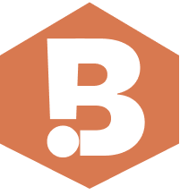

# 🛠️ Build!t - Where Innovation meets Community!

<div align="center">
  
  
  **Where Innovation Meets Community - In Every Language**
  
  [](https://buildit-indol.vercel.app/)
  [](https://github.com/d-j7code/Buildit.git)
</div>

## The Problem We're Solving

Most developer platforms today follow a "one size fits all" approach, catering exclusively to English-speaking audiences. But here's the reality: **more than half the number of developers worldwide don't speak English as their first language**. 

We're missing out on incredible talent and diverse perspectives because of language barriers. Build!t changes that by creating the first truly multilingual developer community platform.

## What is Build!t?

Build!t is a community platform that connects developers worldwide through hackathons and meetups, regardless of their native language. We believe great ideas shouldn't be limited by language barriers.

**Currently supporting:** English, Spanish, French, and German.

## Tech Stack

- **Frontend:** React 19 + Vite
- **Routing:** React Router DOM v7
- **Styling:** Pure CSS with custom animations
- **Internationalization:** lingo.dev compiler
- **Backend:** Convex (for email subscriptions, we store the email id's and language selected)
- **Email Service:** Brevo API (for multilingual newsletters based on the user's preference)
- **Form Handling:** Formspree (for partner inquiries)
- **Deployment:** Vercel

## The Magic Behind Multilingual Support

We use **lingo.dev's compiler** to make our platform truly multilingual:

The lingo.dev compiler:
- Automatically extracts translatable strings during build
- Generates translation dictionaries for each language
- Provides seamless language switching without page reloads
- Maintains React component structure while enabling translations

## Key Features

✨ **Multilingual Interface** - Full UI translation in 4 languages.  
🎯 **Hackathon Discovery** - Find coding competitions worldwide.  
👥 **Meetup Events** - Connect with local developer communities.  
📧 **Smart Notifications/Mails** - Get updates in your preferred language i.e the language you selected in the site. 
🌍 **Global Community** - Break down geographical and linguistic barriers.  

## Getting Started

```bash
# Clone the repository
git clone https://github.com/d-j7code/Buildit.git

# Navigate to project directory
cd /lang_hack

# Install dependencies
npm install

# Start development server
npm run dev

# Build for production
npm run build
```

## Project Structure

```
src/
├── components/         # Reusable UI components
├── pages/              # Route components
├── lingo/              # Generated translation files
├── utils/              # Helper functions and mock data
└── data/               # Static data and configurations
```

## Upcoming Features

🔄 **Dynamic Content Translation** - Real-time translation of user-generated content like event descriptions and comments.(Comming soon! Please understand as I'm the only developer here😅)

🤖 **AI-Powered Language Detection & localization** - Automatically detect user's preferred language and suggest relevant events in their region


## License

MIT License - see [LICENSE](LICENSE) file for details.

---

<div align="center">
  <strong>Built with ❤️ for the global developer community</strong>
  
  [Website](https://buildit-indol.vercel.app/) 
</div>